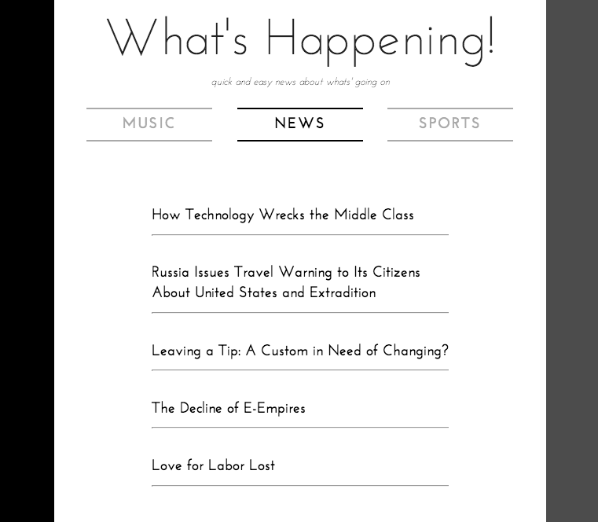

Whats Happening App
-------------------
[Check it out here](www.jlukecarlson.com/apps/whatshappening)

Its a content aggregation django app designed with mobile users in mind

Made by Luke Carlson and Chris Beyer

How to Run It
=============

This repo is a django app so add it to your INSTALLED_APPS in the settings file

Next, add this to your urls (in this case the files were put in a folder called 'whatshappening'):

      urlpatterns += patterns('',
                        (r'^apps/whatshappening/', include('whatshappening.urls')),

